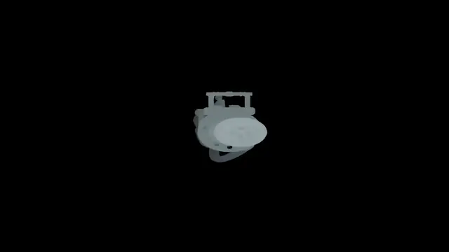

# UnitySoftwareRasterizer

A software rasterizer built inside [Unity][unity-link], where the whole triangle rasterization pipeline runs on the CPU. The GPU only blits the finished framebuffer to the screen. It's a research project exploring how a classic rasterizer maps onto a strictly ECS-based architecture, inspired by [tinyrenderer][tinyrenderer-link] by Dmitry V. Sokolov.

The ECS framework is [StaticECS][staticecs-link]. The rasterization inner loop is compiled with [Burst][burst-link] and scheduled through the Unity [Job System][jobs-link], operating on `NativeArray` color and depth buffers.

<p align="center">
  
</p>

## How it works

The renderer is split into two assemblies. `SoftwareRasterizer.Core` holds the ECS world and the rasterizer itself: `ObjectMesh` and `ObjectColor` components store a mesh's vertex and index `NativeArray`s together with its color, a `FrameBuffer` resource wraps the color and depth buffers, and `DrawSystem` schedules a Burst-compiled `RasterizeJob` per mesh that spins each triangle around the Y axis over time, projects it from NDC into screen space, bounds it with a screen-space AABB, fills it using barycentric coordinates with a depth test, and shades pixels by interpolated depth.

`SoftwareRasterizer.Demo` is the Unity glue: `SoftwareRendererBehaviour` boots the ECS world, uploads Unity meshes as entities, ticks the system every frame, and copies the framebuffer into a texture, `PixelScreen` builds a point-filtered quad that displays the framebuffer at an arbitrary resolution through the `FramebufferBlit` URP shader, and `CameraAnimation` flies the camera to a target point on input.

## Example

`DemoScene` rasterizes a spinning [Ray Gun][raygun-model] mesh into a low-resolution pixel screen. Resolution, pixel size and color are adjustable from the Inspector.

Rendering runs at ~70 FPS on 22,887 triangles (Apple M4 Pro, 12-core CPU / 16-core GPU).

## Building and running

Requires Unity `6000.5.1f1` (or a compatible Unity 6 version).

```bash
git clone https://github.com/d4nilevi4/UnitySoftwareRasterizer.git
```

Open `src/UnitySoftwareRasterizer` in Unity, then open and play `Assets/SoftwareRasterizer/Demo/Scenes/DemoScene.unity`.

## Resources

- **Ray Gun** model by [XOIAL][raygun-author] on [Sketchfab][raygun-model], used under the [Sketchfab Free Standard License][sketchfab-license].

[unity-link]: https://unity.com
[tinyrenderer-link]: https://haqr.eu/tinyrenderer/
[urp-link]: https://docs.unity3d.com/Packages/com.unity.render-pipelines.universal@17.5/manual/index.html
[staticecs-link]: https://github.com/Felid-Force-Studios/StaticEcs
[burst-link]: https://docs.unity3d.com/Packages/com.unity.burst@latest
[jobs-link]: https://docs.unity3d.com/Manual/job-system.html
[raygun-model]: https://sketchfab.com/3d-models/ray-gun-fc0703bc4ddc47d8b7098ff3ce5e4bbb
[raygun-author]: https://sketchfab.com/XOIAL
[sketchfab-license]: https://sketchfab.com/licenses
